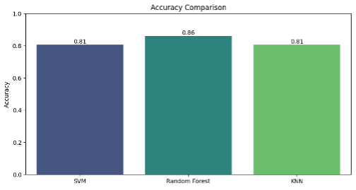
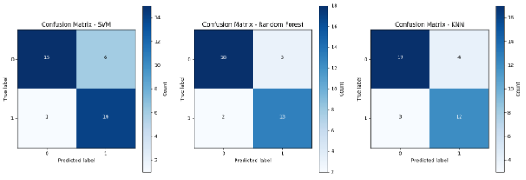
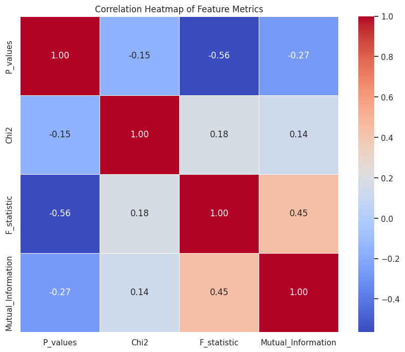
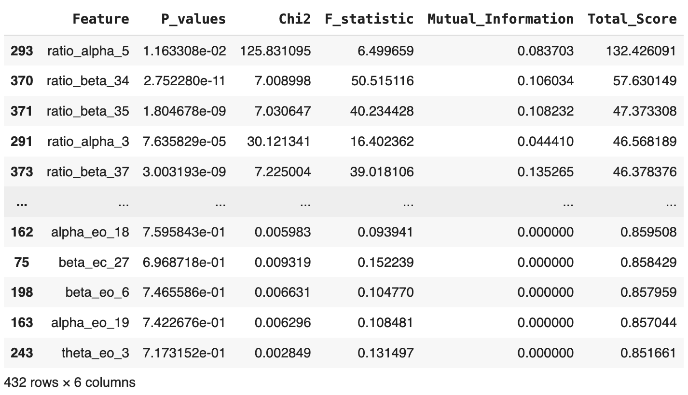
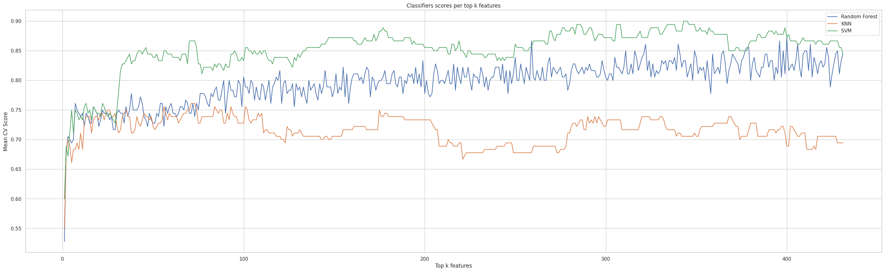

# Feature Engineering for Predicting Central Neuropathic Pain

## Project Overview

Predicting Central Neuropathic Pain (CNP) in individuals with Spinal Cord Injury (SCI) is a challenging yet crucial task. This project aims to develop a feature engineering strategy using brain Electroencephalogram (EEG) data to predict the likelihood of patients developing CNP. The dataset consists of EEG recordings from 18 SCI patients, with 8 patients classified as 'negative' (did not develop CNP) and 10 as 'positive' (developed CNP within 6 months).

## Project Structure

The repository is organized into four main files, each focusing on a different aspect of feature engineering:

1. **[Feature_Selection_Filtering_Methods.ipynb](Feature_Selection_Filtering_Methods.ipynb)**: Explore and implement filtering methods for feature selection, such as GridSearchCV, SelectKBest, Recursive Feature Elimination (RFE), Principal Component Analysis (PCA), RandomForest, LASSO, and Support Vector Machine (SVM).

2. **[Feature_Selection_Embedding_Methods.ipynb](Feature_Selection_Embedding_Methods.ipynb)**: Investigate and apply embedding methods for feature selection, specifically using Support Vector Machine (SVM), k-Nearest Neighbors (KNN), and Random Forest classifiers.

3. **[Feature_Selection_Wrapper_Methods.ipynb](Feature_Selection_Wrapper_Methods.ipynb)**: Implement wrapper methods for feature selection, including Backward and Forward Feature Elimination for Random Forest and Support Vector Machine (SVM) classifiers.

4. **[Feature_Extraction_Methods.ipynb](Feature_Extraction_Methods.ipynb)**: Explore various feature extraction techniques, such as standardization with Principal Component Analysis (PCA), Singular Value Decomposition (SVD) with Randomized PCA, t-distributed Stochastic Neighbor Embedding (t-SNE), binarization, and one-hot encoding.

## Dataset

- **Participants**: 18 SCI patients
  - 8 'negative' (did not develop CNP)
  - 10 'positive' (developed CNP within 6 months)
  
- **EEG Data**:
  - 48 electrode EEG recordings at 250 Hz
  - Recorded with eyes closed (EC) and eyes opened (EO)
  - Segments of 5-second length with 10 repetitions per participant
  - Preprocessed data with signal denoising, normalization, temporal segmentation, and frequency band power estimation
  - 180 labeled data points (18 participants with 10 repetitions each) x 432 columns (9 features x 48 electrodes)

## Objective Measure

The evaluation is based on Leave-One-Subject-Out Cross-Validation, considering accuracy, sensitivity, and specificity as key metrics.

## Classification Algorithms

### SVM (Support Vector Machine)

A supervised learning algorithm used for binary classification tasks. Effective for problems with clear separation margins between classes. The decision boundary is found by maximizing the separation of classes via a line or decision plane.

### KNN (K-Nearest Neighbor)

Operates by creating groups from closely related data points. Training time is low, making it suitable when classes have significant separations.

### Random Forest Classifier

A collection of random decision trees, less sensitive to training data than a single decision tree. It avoids overfitting and generalizes well to new data.

### Training Without Feature Selection

*Figure 1: Accuracy Obtained Before Feature Selection*

*Figure 2: Confusion Matrix Before Feature Selection*

## Methodology

1. **Feature Engineering Techniques**: Explore three techniques—Filtering, Wrapping, and Embedding.
2. **Classifier Models**: Test on three commonly used classifiers for EEG data—KNN, SVM, and Random Forest.
3. **Performance Measurement**: Utilize Leave-One-Subject-Out Cross-Validation for accuracy, sensitivity, and specificity.

## Feature Selection Methods

### Filtering Methods

1. **Measure Relevance**: Utilize scores like f_statistics, p_statistics, chi2_scores, and mutual_info_scores.
2. **Rank Features by Relevance**: Sum of scores determines top features.
3. **Keep Top K Relevant Features**: Use cross-validation with various approaches.
   - GridSearchCV with SVM
   - GridSearchCV with PCA and SVM
   - GridSearchCV, SelectKBest, RFE, PCA with RandomForest, LASSO, and SVM
   - Manual selection (Brute Force)

   
   *Figure 3: Correlation Heatmap of Feature Metrics*

   
   *Figure 4: Features Ranked by Relevance (Total Score)*

   | Number of Selected Features (k) | Mean Accuracy |
   |----------------------------------|---------------|
   | Approach 1                       | 151           | 0.89          |
   | Approach 2                       | 89            | 0.88          |
   | Approach 3                       | 202           | 0.91          |
   | Approach 4                       | 343 (SVM)      | 0.9           |

4. **Hyperparameters Optimization**: Tune parameters for Random Forest, KNN, and SVM.

   
   *Figure 5: Mean Accuracy of Top k Selected Features*

### Wrapper Methods

1. **Backward Elimination**: Remove least impactful features until a threshold is met.

   - Initial Performance: 0.822
   - Removed feature: theta_ec_18
   - Updated Performance: 0.867
   - Performance degraded. Stopping.

2. **Bi-directional Elimination**: Combine forward and backward elimination.

### Embedded Methods

1. **L1 Regularization (LASSO Regression)**: Encourages sparsity in the model by adding a penalty term.

2. **L2 Regularization (Ridge Regression)**: Takes the sum of squared coefficients as a penalty term.

3. **Elastic Net Regression**: Combines L1 and L2 regularization.

   - Result: L1 and ElasticNet produced few non-zero coefficients, indicating low multicollinearity.

   
   *Figure 6: Ridge Regression Scores*

## Feature Extraction Methods

### Standardization & PCA

Standardization rescales features to have a mean of 0 and standard deviation of 1. PCA identifies principal components.

### Singular Value Decomposition (SVD) & Randomized PCA

SVD decomposes a matrix into three others, providing a compact representation. Randomized PCA is an approximation algorithm.

### t-SNE for Non-linear Projection

t-SNE is effective for visualizing high-dimensional data in a lower-dimensional space.

### Binarization

Binarization converts continuous values into binary format based on a threshold.

### One-Hot Encoding

One-Hot Encoding represents categorical variables as binary vectors.

## Evaluation Techniques

- **Leave-One-Subject-Out Cross-Validation**: Evaluate accuracy, sensitivity, and specificity.

## Results & Conclusion

The feature engineering methods significantly impacted model performance. Filtering methods consistently achieved high accuracy but were time-consuming. Wrapper methods, while effective, demanded significant computation time. Embedded methods showed varied outcomes, with SVM and KNN achieving high accuracy. Feature extraction methods required careful consideration and exhibited sensitivity to data characteristics.

### Summary of Results

| Approach (Algorithm)                           | Mean Accuracy |
|------------------------------------------------|---------------|
| Without Feature Selection                       | SVM: 0.81, RF: 0.86, KNN: 0.81 |
| Filtering Methods                               | SVM: 0.91, SVM (PCA): 0.88, Manual: 0.9 |
| Wrapper Methods                                 | SVM (Backward): 0.92 |
| Embedded Methods                                | Ridge Regression (SVM): 0.95, Ridge Regression (KNN): 0.74, Ridge Regression (RF): 0.85 |
| Feature Extraction                               | Standardization & PCA: 0.92, SVD & Randomized PCA: 0.56, t-SNE: 0.58, Binarization: 0.92, One-Hot Encoding: 1.00 |

In conclusion, the choice of feature engineering method significantly influences model performance. Understanding the trade-offs between computation time and accuracy is crucial for selecting the most suitable technique for a given scenario.

